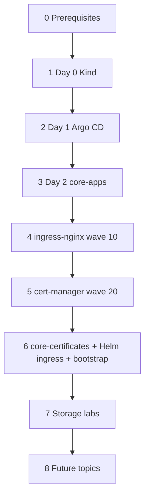

# Learning notes (k8s-platform)

Personal learning journal tied to **this repo**. Operational runbooks stay in [`docs/`](../docs/) and phase READMEs; here you get **why**, **order**, and **mental models** so you can pick up again months later.

**Start here:** read the sequence below once, then follow the numbered guides in order.

---

## Learning sequence (what first, what next)

| Step | Guide | You learn | Repo status |
|------|--------|-----------|-------------|
| **0** | [Prerequisites](./00-prerequisites.md) | Tools, profiles (`dev` / `stg` / `prod`), naming | — |
| **1** | [Day 0 — Cluster](./01-day0-cluster.md) | Kubernetes API, Kind, kubeconfig | **Done** in repo |
| **2** | [Day 1 — Bootstrap](./02-day1-bootstrap.md) | Argo CD, Helm, Git credentials, chicken-and-egg | **Done** in repo |
| **3** | [Day 2 — GitOps core](./03-day2-gitops-core.md) | App of Apps, AppProject, sync waves, multi-source Helm | **Done** in repo |
| **4** | [ingress-nginx](./04-ingress-nginx.md) | Ingress controller, Kind hostPort, IngressClass `nginx` | **Done** in repo |
| **5** | [cert-manager](./05-cert-manager.md) | TLS CRDs, controller, before `Certificate` manifests | **Done** in repo |
| **6** | [Argo CD ingress & TLS](./06-argocd-ingress-tls.md) | `core-certificates`, Helm ingress, two-step bootstrap, UI | **Done** in repo |
| **7** | [Storage fundamentals](./storage.md) | PV/PVC, RWO/RWX, Kind labs, CSI (OpenEBS) | **Notes only** — labs not in Git yet |
| **8** | [What's next](./08-whats-next.md) | Observability, policy, cloud Day 0, team apps | **Not started** |



---

## One-page cheat sheet (dev)

Run from repo root after `chmod +x scripts/*.sh infra/kind/*.sh bootstrap/bootstrap.sh bootstrap/argocd/install.sh`.

```bash
# Steps 1–2: cluster + Argo CD
./scripts/kind-up.sh dev

# Step 3: Argo must clone GitHub — push first
git push origin main
source scripts/kubeconfig-setup.sh .kube/kind-dev.yaml
./scripts/gitops-start.sh dev

# Steps 4–6: wait for ingress-nginx, cert-manager, core-certificates (Argo UI)
kubectl get applications -n argocd
kubectl get certificate -n argocd argocd-server-tls
./bootstrap/bootstrap.sh dev
# /etc/hosts: 127.0.0.1 argocd.dev → https://argocd.dev:8443
```

Teardown (Day 0 only): `./infra/kind/destroy.sh dev`

---

## How this folder relates to the repo

| If you need… | Read |
|--------------|------|
| Exact commands and troubleshooting | [`docs/platform-lifecycle.md`](../docs/platform-lifecycle.md), [`infra/README.md`](../infra/README.md), [`bootstrap/README.md`](../bootstrap/README.md), [`gitops/README.md`](../gitops/README.md) |
| Concepts and “what did I build?” | Numbered guides in this folder |
| Copy-paste platform YAML | [`gitops/`](../gitops/) |

When you finish a lab, update the **Repo status** row in the table above (e.g. “lab done on Kind dev”).

---

## File index

| File | Contents |
|------|----------|
| [00-prerequisites.md](./00-prerequisites.md) | Tools, env files, profile naming |
| [01-day0-cluster.md](./01-day0-cluster.md) | Kind, ports 8080/8443, kubeconfig |
| [02-day1-bootstrap.md](./02-day1-bootstrap.md) | Argo CD install, secrets, what stays out of GitOps |
| [03-day2-gitops-core.md](./03-day2-gitops-core.md) | `core-apps`, waves, layout rules |
| [04-ingress-nginx.md](./04-ingress-nginx.md) | Platform ingress on Kind |
| [05-cert-manager.md](./05-cert-manager.md) | cert-manager install and CRDs |
| [06-argocd-ingress-tls.md](./06-argocd-ingress-tls.md) | Argo UI TLS + Helm ingress |
| [storage.md](./storage.md) | Block vs file storage; planned Kind labs |
| [08-whats-next.md](./08-whats-next.md) | Roadmap after storage |
